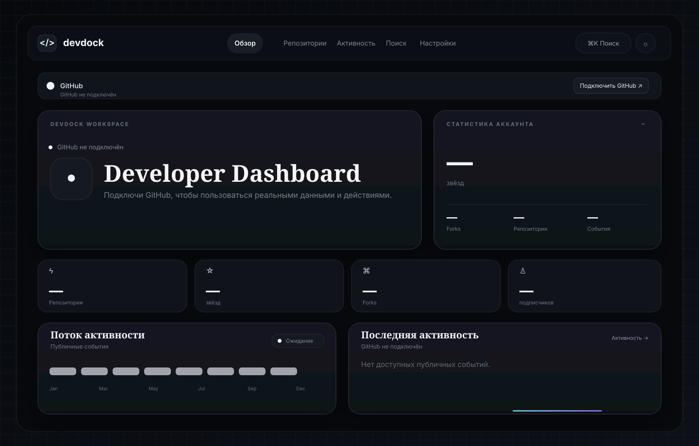

<div align="center">

# DEVDOCK

### Local-first GitHub workspace

Browse GitHub data, inspect repositories, manage files, view activity, and perform repository operations from one focused developer interface.

<p>
  
  
  
  
  
</p>

</div>

---

## 🧭 What is DevDock?

DevDock is a **local-first GitHub workspace** designed to keep common GitHub tasks inside one clean dashboard instead of forcing you to jump between many GitHub pages.

The application is intended to run locally in your browser. GitHub remains the source of truth for account, repository, issue, pull request, release, and other remote data.

The project combines a developer-dashboard style interface with practical repository tools: browsing, searching, inspecting files, editing text files, committing changes, downloading ZIPs, and working with issues and pull requests.

---

## 🖼️ Concept / visual preview

The repository includes a visual concept for the DevDock interface. Click the preview to open the original SVG at full size.

<p align="center">
  <a href="./docs/devdock-concept.svg">
    
  </a>
</p>

> **Concept source:** `docs/devdock-concept.svg`

---

## ✨ Highlights

- GitHub profile and repository dashboard
- Public user and repository search
- Contribution calendar with year switching
- Repository file browser with folder navigation
- Text editor with commit support
- File and folder upload helpers
- Repository ZIP downloads
- Issues, pull requests, and releases views
- Star / watch / follow / unfollow actions where GitHub permissions allow them
- Account tools for profile, email, organizations, notifications, SSH keys, and gists
- Russian / English interface
- Configurable refresh interval
- Local credential storage in the browser
- Dark glassmorphism UI inspired by modern developer portfolio interfaces

---

## 🧰 Tech stack

| Technology | Role |
| --- | --- |
| **React** | Application UI and reusable components |
| **TypeScript** | Type-safe application code |
| **Vite** | Local development server and production bundling |
| **Tailwind CSS** | Utility-based interface styling |
| **React Router** | Client-side navigation |
| **Lucide React** | Interface icons |
| **Recharts** | Data visualization |
| **Vitest** | Automated tests |
| **ESLint** | Static analysis and code quality |

---

## 📋 Requirements

Install these before starting:

- **Node.js 18+**
- **npm 9+**
- **Git**

Verify everything from your terminal:

```bash
node --version
npm --version
git --version
```

---

## 🚀 Quick start

### 1. Clone the repository

```bash
git clone https://github.com/pucun851/github-devdock.git
cd github-devdock
```

### 2. Install dependencies

```bash
npm install
```

### 3. Run the development server

```bash
npm run dev
```

Vite will print the local URL. By default it is normally:

```text
http://localhost:5173/
```

Open that address in your browser.

### 4. Connect your GitHub account

Inside DevDock, open:

```text
Settings → Account
```

Provide:

- your GitHub username;
- a GitHub fine-grained Personal Access Token.

The project is designed for local use, and these values are stored locally in the browser according to the current application design.

**Never commit a token, secret, private key, or `.env` file containing credentials.**

---

## 🔐 GitHub permissions

For DevDock's write operations, your GitHub token needs the permissions required by the specific action.

The exact permissions depend on what you want to do. Read-only browsing and write actions should be treated separately, and the safest setup is to grant only the minimum access needed.

Examples of operations that may require additional permissions include:

- editing or creating repository files;
- creating commits;
- working with issues or pull requests;
- changing repository metadata;
- account-level operations exposed by the UI.

### ⚠️ Important

Keep GitHub credentials private. Do not put a token directly into source files or push it to GitHub.

---

## ▶️ Development commands

### Start development mode

```bash
npm run dev
```

Use this while developing. Vite serves the app locally and reloads changes quickly.

### Build for production

```bash
npm run build
```

The optimized output is generated inside:

```text
dist/
```

### Preview the production build

```bash
npm run preview
```

This lets you inspect the generated `dist/` application locally through Vite's preview server.

### Run tests

```bash
npm run test
```

### Run lint

```bash
npm run lint
```

A useful pre-push check is:

```bash
npm run lint && npm run test && npm run build
```

---

## 🗂️ Project structure

```text
github-devdock/
├── docs/
│   ├── concept.md
│   └── devdock-concept.svg
├── src/
│   ├── App.tsx
│   ├── main.tsx
│   ├── index.css
│   └── styles/
│       └── index.css
├── tests/
│   ├── cache.test.ts
│   └── format.test.ts
├── .gitignore
├── eslint.config.js
├── index.html
├── package.json
├── postcss.config.js
├── tailwind.config.js
├── tsconfig.json
├── tsconfig.app.json
├── tsconfig.node.json
└── vite.config.ts
```

### Main files

#### `src/main.tsx`

The application entry point. It creates the React root and mounts the application.

#### `src/App.tsx`

The main application layer: page layout, navigation, views, reusable components, and GitHub workspace UI.

#### `src/index.css`

Global CSS imported by the application entry point.

#### `src/styles/index.css`

Additional stylesheet used by the UI.

#### `tests/`

Vitest tests for project functionality.

#### `docs/devdock-concept.svg`

The visual concept preview shown above.

---

## 🧠 Application areas

### Dashboard

The dashboard is the starting point for the workspace and presents the most important account and repository information in one place.

### Users

Search public GitHub users and inspect their public information and activity.

### Repositories

Open repository details and browse repository contents through a folder-style file browser.

### Files

Open text files, inspect their contents, and use the editor/commit workflow for supported repository changes.

### Activity

Review recent GitHub activity in one place instead of navigating between multiple account pages.

### Issues / Pull requests / Releases

The application exposes repository collaboration information through dedicated views.

### Account tools

The current application includes utilities for profile information and other GitHub account resources exposed by its UI.

---

## 🎨 Visual style

DevDock uses a developer-oriented dark interface with a restrained glassmorphism treatment.

The visual language is built around:

- near-black surfaces;
- soft translucent panels;
- subtle borders;
- restrained cyan/blue accents;
- compact metadata text;
- rounded cards;
- clear status states;
- responsive desktop/mobile navigation.

The concept artwork in `docs/devdock-concept.svg` is the visual reference point for the overall direction.

---

## 🌍 Language support

The interface supports **Russian and English**.

Use the application's language controls to switch the UI without changing the codebase.

---

## 🔄 Refresh settings

DevDock includes a configurable refresh interval for GitHub data.

This is useful when you want a workspace that stays current without manually refreshing every view.

---

## 🧪 Testing workflow

When making changes, a good local sequence is:

```bash
npm install
npm run lint
npm run test
npm run build
npm run dev
```

If the build fails, fix the **first** TypeScript/Vite error shown in the terminal before chasing secondary errors.

---

## 🧯 Troubleshooting

### `npm install` does not work

Check Node and npm versions:

```bash
node --version
npm --version
```

Then retry:

```bash
npm install
```

### The app opens but looks unstyled

Restart the Vite process after changing dependencies or CSS tooling:

```bash
npm run dev
```

If dependencies have become inconsistent, reinstall them.

#### Windows PowerShell

```powershell
Remove-Item -Recurse -Force node_modules
Remove-Item -Force package-lock.json -ErrorAction SilentlyContinue
npm install
npm run dev
```

#### Linux / macOS

```bash
rm -rf node_modules package-lock.json
npm install
npm run dev
```

### Port 5173 is busy

Run Vite on another port:

```bash
npm run dev -- --port 5174
```

Then open the URL shown by Vite.

### A route shows `Not found`

Verify that the URL is one of the routes registered by the application and restart the development server after route changes.

### GitHub requests fail

Check:

1. The GitHub username is correct.
2. The token has not expired or been revoked.
3. The token has the permissions required by the operation.
4. You are not exposing the token in the frontend source or committing it to Git.

---

## 🔧 Typical change workflow

### Modify the UI

1. Open the relevant React code in `src/App.tsx` or another component file.
2. Adjust the component structure.
3. Update styling using the existing Tailwind/CSS conventions.
4. Run the dev server and inspect the result.
5. Run tests and a production build before committing.

### Add a new route

Use React Router in the application routing layer.

A route generally follows this pattern:

```tsx
<Route path="/example" element={<ExamplePage />} />
```

Then add a navigation item if the page should appear in the main navigation.

### Change global styles

Start with:

```text
src/index.css
src/styles/index.css
```

### Change build configuration

Edit:

```text
vite.config.ts
postcss.config.js
tailwind.config.js
```

Only change build tooling when there is a clear reason; UI changes should normally stay inside the application/styles layer.

---

## 📦 Production deployment

The project is built with Vite. A production build is created with:

```bash
npm run build
```

The resulting static files are in `dist/`.

They can then be served by a static hosting provider or web server that supports a client-side React application.

For direct client-side GitHub API access, remember that credentials are sensitive. A public deployment should not hard-code a personal access token into the application bundle.

---

## 🔀 Git workflow

A typical contribution workflow:

```bash
git pull
npm install
npm run dev
```

After making changes:

```bash
npm run lint
npm run test
npm run build
```

Then commit:

```bash
git add .
git commit -m "feat: update DevDock"
git push
```

---

## 📚 Documentation files

The project includes:

```text
docs/concept.md
```

for the project concept and:

```text
docs/devdock-concept.svg
```

for the visual concept.

---

## 📄 License

MIT License.

---

<div align="center">

**DEVDOCK** — a focused local-first GitHub workspace.

</div>
